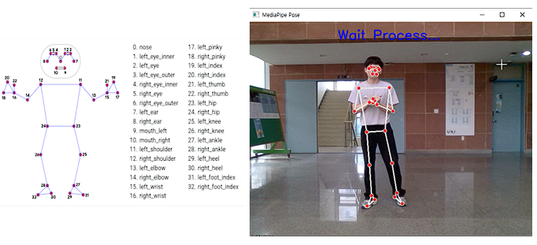
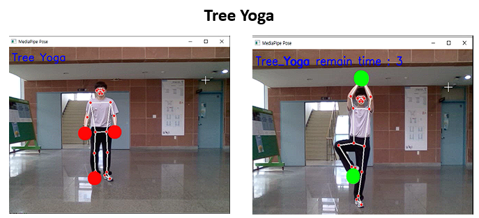
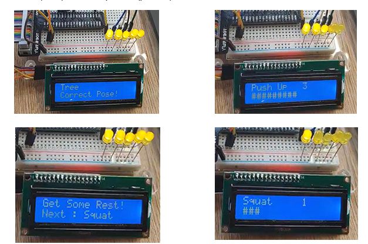

# Interval_traning_System
You can see your workout and progress on the window screen and Text To Speech, LCD, and LEDs. Raspberry Pi project that uses a window screen, Text To Speech, LCD, and LEDs.

- 유튜브영상
https://youtu.be/ncWoqXjhSyE

- 아이디어붐 페이지
http://www.ideaboom.net/project/project/view?seq=1159&search_keyword=pose&data_seq[]=1&data_seq[]=2&data_seq[]=3&data_seq[]=4&data_seq[]=5&data_seq[]=6&data_seq[]=7&data_seq[]=8&data_seq[]=9&data_seq[]=10&data_seq[]=11&data_seq[]=12&data_seq[]=13&order=reg
# Pose Detection을 이용한 Interval 운동 시스템

> 자신의 운동 모습과 진행상태를 윈도우 화면과 Text To Speedch, LCD, LED를 이용해 알려주는 라즈베리파이 프로젝트
> 

### 동기

- 운동을 처음 시작하는 사람들에게 어려움이 있다
- 자세, 횟수를 알려주면 운동에 더욱 집중 할 수있다.
- 운동을 쉽게 꾸준히 하여 건강을 챙긴다.

### MediaPipe

- Mediapipe의 Pose Detection을 활용해 사람의 신체 부위의 위치를 파악하고, 변화를 인식해, 어떤 운동을 진행하였는지 알 수 있음
- 특정 자세를 올바르게 유지한 경우에만 초록색 원과 시간의 흐름으로 자세 만족을 알려준다.
- 자세 종류
    - 요가자세
    - 푸쉬업
    - 스쿼트

### Text to Speedch, Picad LCD

- 사용자에게 Text To Speech 와 LCD, LED를 이용해 현재 운동의 진행 상황과 운동순서를 제공한다.
